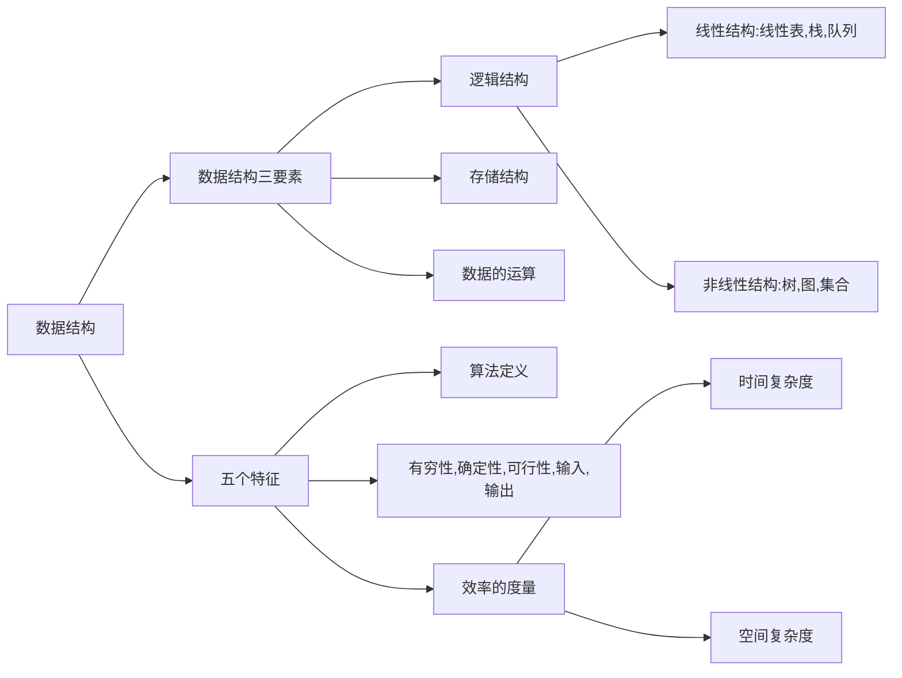

- #type/note #category/computerScience/dataStructure #source/video
- [数据结构精讲@研芝士](https://youtube.com/playlist?list=PLjAs5kw1NNs2Gybp6TWrmvjmpylw1zQc6)

# 1.1 数据结构的基本概念

## 数据
![[数据]]

## 数据元素
![[数据元素]]

## 结构
![[结构]]

## 数据结构
![[数据结构]]

## 数据对象
![[数据对象]]

## [[数据类型]]
- [[数据类型]] 是一个 **值的集合** 和定义在此集合上的 **一组操作** 的总称.
	- ***值 + 操作*** 
	- 包括 [[原子类型]] 和 [[结构类型]]
		- [[原子类型]] :
		- [[结构类型]]: 可以 **再分解** 为若干成分的 [[数据类型]]  .
			- 例如: [[数组]] , [[列表]] , [[对象]] . 

## [[抽象数据类型]]/[[ADT]]

是[[抽象数据]] **组织** 及与之相关的 **操作**.
- **不讨论** 具体信息.
- 只考虑相关逻辑结构和数据运算, **不讨论** 物理结构.

## [[数据结构的三要素]]
### [[逻辑结构]]
### [[物理存储结构]]
### [[数据运算]]
