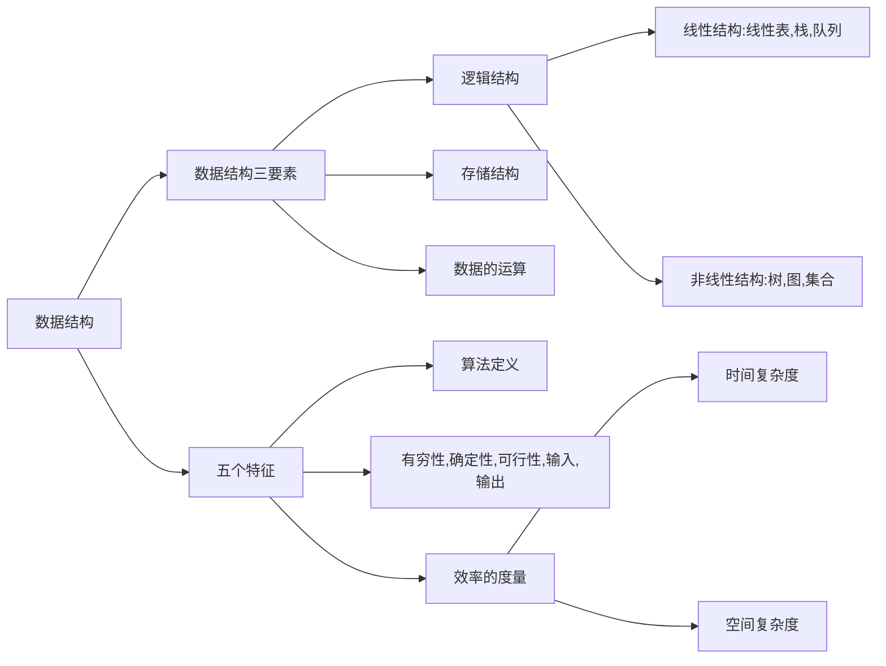

# note.研芝士.数据结构精讲@

## 1.1 数据结构的基本概念

### [[数据]]

- 数据是信息的 **载体** , 是 **描述客观事物** 属性的数,字符及所有能输入到计算机中并别计算机程序 **识别和处理的符号的集合** , 数据是计算机程序加工的 **原料** . 

### [[数据元素]]

- [[数据元素]] 是 **[[数据]]** 的 **基本单位** . 
	- 通常作为一个整体进行考虑和处理. 
- 一个 [[数据元素]] 可以由若干 [[数据项]] 组成.
	- [[数据项]] 是构成数据元素的 **最小单位** .
- [[数据元素]] 是 [[对象]].
	- [[数据项]] 是数据的 **属性** .
- 要根据实际的业务需求来确定是 [[数据元素]] , 什么是 [[数据项]] .

### [[结构]]

- [[结构]] 是各个 [[数据元素]] 之间的 **关系** .

### [[数据结构]]

- [[数据结构]] 是相互之间存在一种或多种 **特定关系** 的 [[数据元素]] 的集合. 

### [[数据对象]]

- [[数据对象]] 是具有 **相同性质** 的 [[数据元素]] 的集合, 是 [[数据]] 的一个子集. 

### [[数据类型]] 

- 是一个 **值的集合** 和定义在此集合上的 **一组操作** 的总称.
		- **值 + 操作**
- 包括 [[原子类型]] 和 [[结构类型]]
	- [[原子类型]] : 不可再分的数据类型
	- [[结构类型]]: 可以 **再分解** 为若干成分的 [[数据类型]]  .
		- 例如: [[数组]] , [[列表]] , [[对象]] . 

## [[抽象数据类型]]

- 是[[抽象数据]] **组织** 及与之相关的 **操作**.
	- **不讨论** 具体信息.
	- 只考虑相关逻辑结构和数据运算, **不讨论** 物理结构.

## 数据结构的三要素

### 逻辑结构

### 物理存储结构

### 数据运算